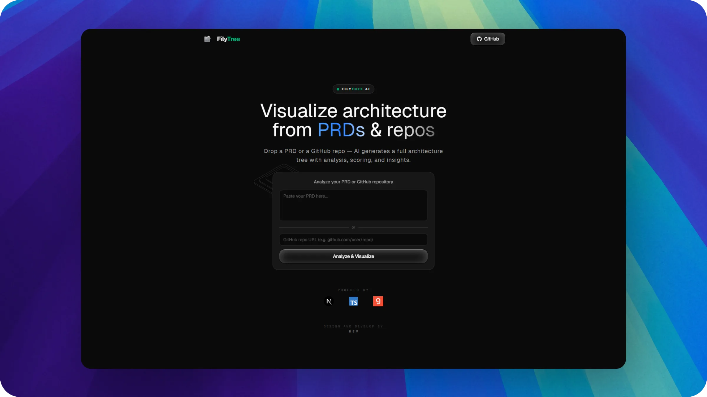

# FilyTree

**AI-powered architecture visualization tool** that transforms PRDs or GitHub repositories into interactive, AI-analyzed architecture diagrams.



## Features

- **PRD → Architecture Tree** — Paste a product requirements document and get a full software architecture generated by AI (Groq LLM).
- **GitHub Repo Analysis** — Provide a GitHub URL and the AI analyzes your existing codebase structure, producing an interactive tree with a score, issues, and suggestions.
- **Interactive D3 Canvas** — Zoomable, pannable, draggable tree visualization with color-coded nodes and expandable/collapsible folders.
- **AI Inspector** — Click any node to get an on-demand AI explanation, reasoning, and improvement suggestions.
- **Architecture Score** — Dedicated analysis page with a quality score (0–100) and issue breakdown.

## Tech Stack

[Next.js 16](https://nextjs.org) · [React 19](https://react.dev) · [TypeScript 6](https://www.typescriptlang.org) · [Tailwind CSS 4](https://tailwindcss.com) · [D3.js 7](https://d3js.org) · [Framer Motion 12](https://motion.dev) · [Zustand 5](https://github.com/pmndrs/zustand) · [Groq API](https://groq.com)

## Getting Started

```bash
bun install
bun dev
```

Open [http://localhost:3000](http://localhost:3000).

You'll need a **Groq API key** — set it as `NEXT_PUBLIC_GROQ_API_KEY` in `.env` or enter it at runtime in the app.

## Usage

1. **PRD mode** — Paste a product requirements document and click *Generate Architecture*.
2. **GitHub mode** — Paste a GitHub repo URL (e.g. `github.com/user/repo`) and click *Analyze Repository*.
3. Explore the interactive tree — zoom, pan, drag, expand/collapse folders.
4. Click any node to inspect it with the AI panel.
5. Visit `/analysis` for the full architecture score and issue breakdown.
